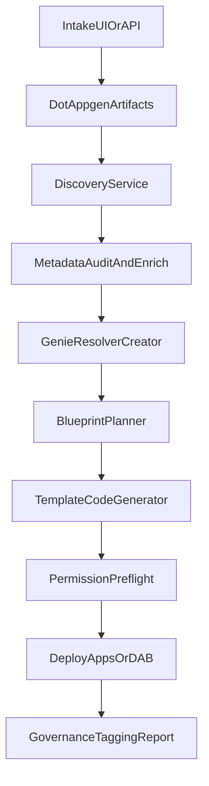

# Design — Unified Composer + AppGen

## Architecture overview

## Runtime boundaries

| Layer | Location | Responsibility |
|------|----------|----------------|
| Product core | `src/composer/` | Unified implementation for intake, discovery, planning, generation, deployment |
| Compatibility API | `modules/` | Existing FastAPI/CLI interfaces preserved during migration |
| Artifact persistence | `.appgen/` | Structured YAML artifacts and approval records |

## Core modules

- `composer/core`: config, logging, artifacts, approvals.
- `composer/databricks`: SDK client wrapper.
- `composer/llm`: Foundation Model client.
- `composer/discovery`, `composer/metadata`, `composer/genie`.
- `composer/blueprint`, `composer/codegen`.
- `composer/permissions`, `composer/provision`, `composer/deploy`.
- `composer/agent`: state machine primitives for orchestration.

## Delivery architecture

- CI: `.github/workflows/ci.yml`.
- Testing: unit + flow tests via `pytest`.
- Governance: dry-run by default + explicit approval gates before writes.

## References

- Blueprint: `docs/blueprint.md`
- Risk register: `docs/gapmaster.md`
- Examples: `examples/vertical_case.md`